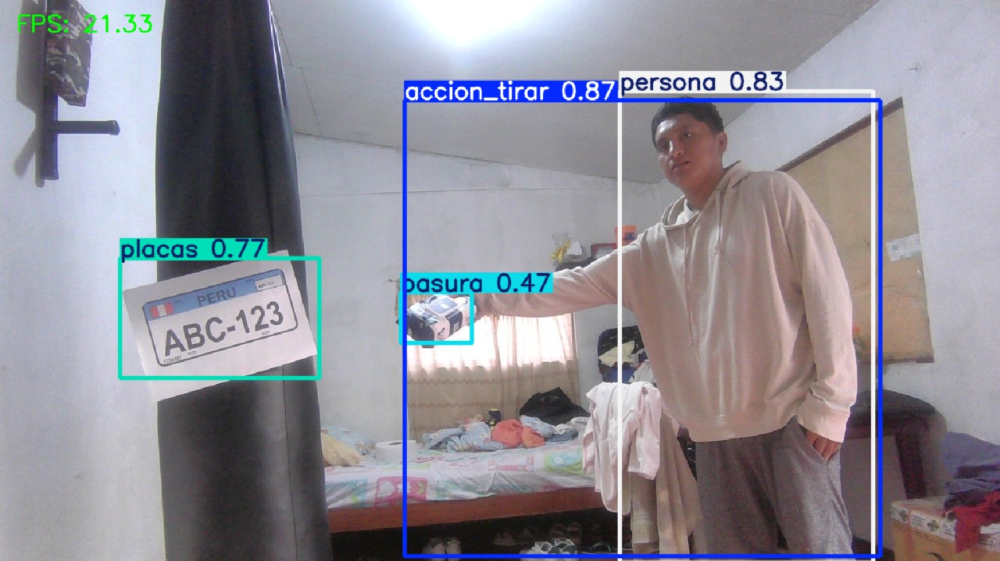
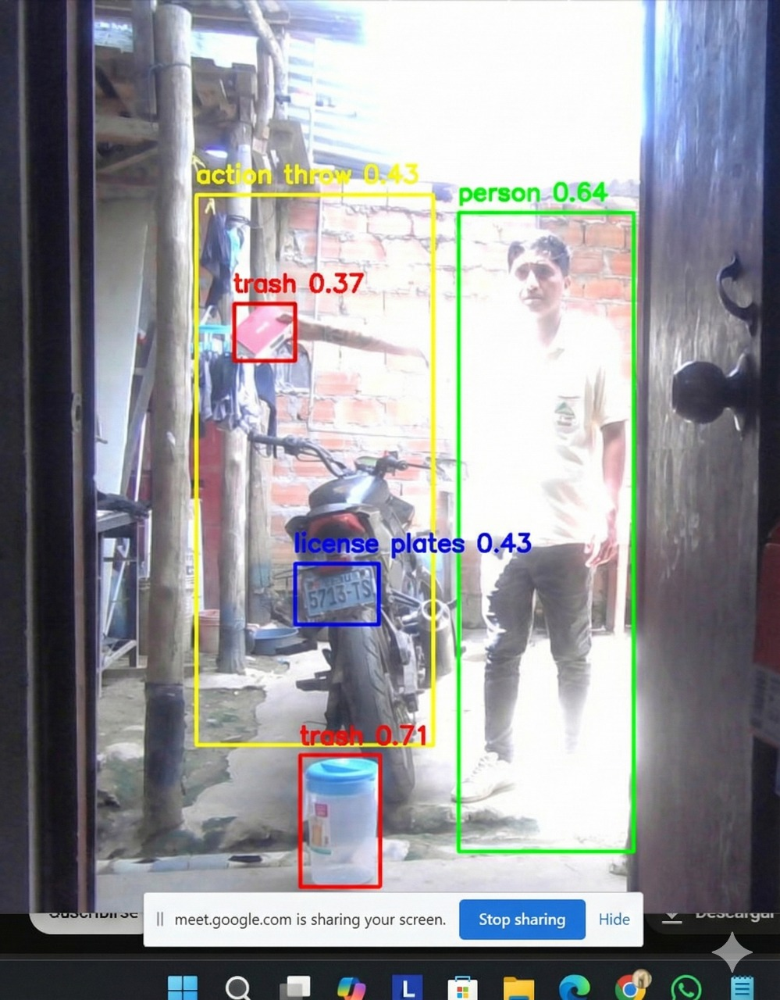

# 🚮 Sistema de Detección de Basura con IA

Este proyecto implementa modelos de **YOLO (v8 y v11)** para detectar personas arrojando basura en tiempo real. Utiliza visión por computadora para monitorear y generar alertas automáticas.

## 📸 Demostración del Sistema

### Detección en Acción


### Pruebas Adicionales


> *El sistema procesa el video frame a frame calculando la intersección entre personas y objetos detectados.*

## 📂 Contenido del Repositorio
* **`fps_yolov8.py`**: Script principal de inferencia usando YOLOv8.
* **`fps_yolov11.py`**: Versión actualizada para pruebas con YOLOv11.
* **`inferencia.py`**: Módulo base para la lógica de detección.

## 🛠️ Tecnologías
* **Python 3.9+**
* **Ultralytics YOLO** (Modelos de detección de objetos)
* **OpenCV** (Procesamiento de imagen)
* **Roboflow** (Gestión del Dataset)

## 🚀 Cómo ejecutarlo
1. Clona el repositorio.
2. Instala las dependencias:
   ```bash
   pip install -r requirements.txt
  
